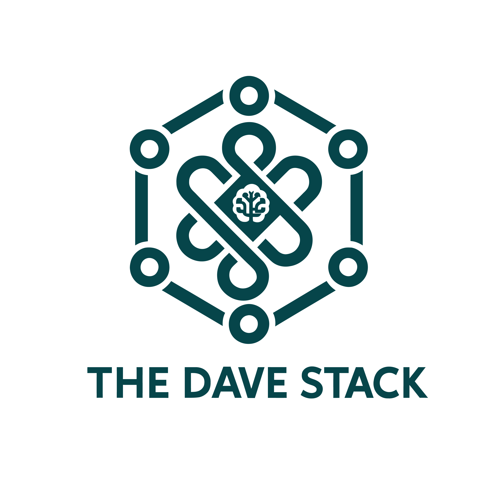

<p align="center">
  
</p>

# The Dave Stack Theme for Ghost

Welcome to the official Ghost theme repository for **The Dave Stack** (`https://www.thedavestack.com`). This theme is designed to be clean, content-focused, and fully responsive, serving as the digital face for "The Dave Stack" brand, which centers on IT services, application deployment, community building, and sharing knowledge about artificial intelligence.

This theme is a customized and enhanced fork of the Aesto theme, specifically tailored to the needs and identity of "The Dave Stack".

## Key Features

"The Dave Stack" theme inherits the robustness and minimalist design of Aesto, while also incorporating customizations and new functionalities:

* **Clean & Responsive Design**: Adapts to any screen size.
* **Lightweight & Optimized**: Focused on speed and performance.
* **Responsive Images & Lazy Loading**: For efficient image loading.
* **SVG Icons**: Scalable vector graphics for a crisp interface.
* **Light & Dark Mode**: Manual theme switcher with `localStorage` persistence and automatic adaptation to system preferences.
* **Custom Color Palette & Typography**: Defined in `assets/css/vars.css` for "The Dave Stack" brand identity.
* **Instant Search Integrated**.
* **Disqus Comments**: Integration for community interaction.
* **Full Ghost Membership Support**:
    * Sign-in (`/signin/`), Sign-up (`/signup/`), and Account (`/account/`) pages.
    * Pricing Page and Notifications.
    * Call to Action (CTA) for subscriptions.
    * Post visibility based on member access level.
* **Multi-language Support**:
    * Translations ready for English, Spanish, Chinese, Italian, Turkish, and Portuguese.
    * Configurable language switcher in the header to display English, Spanish, and Chinese.
* **Advanced Navigation**:
    * Primary and secondary menus.
    * Multi-level dynamic submenus (implemented with `ghost-dynamic-dropdown`).
* **Koenig Editor Features**: Support for all built-in cards (Gallery, Bookmarks, Embeds, etc.).
* **Responsive Embeds**: YouTube, Vimeo, SoundCloud, Spotify, Twitter, Instagram, and others.
* **Reading Progress Bar**: Indicates reading progress on articles.
* **Table of Contents (ToC)**: Automatically generated for long posts through Tocbot integration (may require specific setup or enabling).
* **Image Lightbox**: Expandable image viewer for a better visual experience.
* **Custom Templates**: For the homepage, tags, and authors pages.
* **Social Sharing**: Integrated into posts.
* **"Load More" Pagination**: For smooth article Browse.
* **SEO Optimized**: Semantic structure and best practices.

## Ghost Version Compatibility

* This theme is compatible with **Ghost CMS version >= 5.0.0**.

## Installation

1.  Download the latest version of the theme from the [Releases](https://github.com/YOUR_USERNAME/YOUR_REPOSITORY/releases) section of this repository (or the appropriate link).
2.  Log in to your Ghost site's admin panel.
3.  Go to `Design > Change theme`.
4.  Click `Upload theme` and select the theme's `.zip` file you downloaded.
5.  Once uploaded, click `Activate` to use the theme.

## Configuration

You can customize several theme options directly from the `package.json` and, in some cases, through your Ghost site settings:

* **Language Selector**: Enable/disable languages (English, Spanish, Chinese) for the language dropdown menu by editing the `custom` section in `package.json` and re-uploading the modified theme.
    ```json
    "config": {
        "custom": {
            "language_dropdown": { "type": "boolean", "default": true, ... },
            "enable_en_language": { "type": "boolean", "default": true, ... },
            "enable_es_language": { "type": "boolean", "default": true, ... },
            "enable_zh_language": { "type": "boolean", "default": false, ... }
        }
    }
    ```
* **Call to Action (CTA) Texts**: Modify `cta_title` and `cta_text` in the `custom` section of `package.json`.
* **Featured Tags on Homepage**: Define the `slugs` of the tags you want to display on the homepage in `featured_tag_slugs` in `package.json`.
* **Navigation and Submenus**: Configure menus from `Settings > Navigation` in Ghost. To create submenus, use the following tags in the menu item's label:
    * `[has_child]`: Indicates a menu item has children.
    * `[subitem]`: Marks an item as part of a submenu.
    * For multi-level submenus (if the `ghost-dynamic-dropdown` library is configured for it):
        * `[-]`: Indicates a second-level submenu parent.
        * `[--]`: Indicates an item within a second-level submenu.

## Development

Follow these steps to set up your local development environment for bug fixing or adding new features.

### Prerequisites

Ensure you have the following installed globally:
* [Node.js](https://nodejs.org/)
* [Yarn](https://yarnpkg.com/)
* [Gulp CLI](https://gulpjs.com/docs/en/getting-started/quick-start) (`npm install --global gulp-cli`)

### Setup

1.  Clone this repository:
    ```bash
    git clone [https://github.com/YOUR_USERNAME/YOUR_REPOSITORY.git](https://github.com/YOUR_USERNAME/YOUR_REPOSITORY.git)
    cd YOUR_REPOSITORY
    ```
2.  Install project dependencies:
    ```bash
    yarn install
    ```
    or simply:
    ```bash
    yarn
    ```
   

### Running Locally

To compile assets (CSS, JS) and watch for changes in real-time with LiveReload:
```bash
yarn dev
````

This command will run the default Gulp task. Source files are located in `assets/scss/` and `assets/js/`. They will be automatically compiled into the `assets/built/` folder. Changes to `.hbs` files will also trigger a browser reload.

### Build Process

  * **CSS**: Styles are compiled from `assets/css/` (primarily `screen.css` which imports others) using Gulp and PostCSS, applying `postcss-easy-import`, `autoprefixer`, and `cssnano` for minification.
  * **JavaScript**: Scripts from `assets/js/` are concatenated and minified to `assets/built/app.min.js`.

### Creating a Theme Package

To package the theme into a `.zip` file ready to upload to Ghost:

```bash
yarn zip
```

This will generate a `dist/<theme-name>_v<version>.zip` file. Tests will run before packaging.

## Contributing

Contributions are welcome\! If you'd like to help improve the theme, please follow these steps:

1.  **Fork** the repository.

2.  **Create a new branch** for your feature or bug fix:

    ```bash
    git checkout -b feature/new-feature or fix/bug-description
    ```

3.  **Make your changes**. Ensure you follow the existing code style.

4.  **Test your changes** thoroughly. You can use `gscan` to validate the theme:

    ```bash
    yarn test
    ```

    This will run `gscan . --verbose` to check for errors or warnings.

5.  **Commit** your changes:

    ```bash
    git commit -m "feat: Add new feature X"
    ```

    (Consider following [Conventional Commits](https://www.conventionalcommits.org/) if you wish).

6.  **Push your changes** to your fork:

    ```bash
    git push origin feature/new-feature
    ```

7.  Open a **Pull Request** against this repository's main branch.

## Automatic Deployment (GitHub Actions)

This repository is configured with GitHub Actions to automatically deploy the theme to The Dave Stack's Ghost instance.

Typically, the GitHub Actions workflow is triggered by a `push` or `merge` to the main branch (or a specific deployment branch). The steps usually include:

1.  Checking out the code.
2.  Setting up the environment (Node.js, Yarn).
3.  Installing dependencies (`yarn install`).
4.  Validating the theme (`yarn test`).
5.  Building and packaging the theme (`yarn zip`).
6.  Deploying the generated `.zip` file to the Ghost instance (using the [Ghost Admin API](https://ghost.org/docs/admin-api/) or community-specific actions for this purpose).

(For more details, review the workflow file in `.github/workflows/`)

## Credits

  * This theme is a fork and customization of the [Aesto](https://github.com/Inoryum-Ltd/aesto) theme by [Inoryum Ltd (now Visioun)](https://visioun.com).
  * Demo images by [Unsplash](https://unsplash.com/).
  * [jQuery](https://jquery.com/).
  * Search Engine by [SearchinGhostEasy](https://github.com/gmfmi/searchinghost-easy).
  * [FitVids.js](http://fitvidsjs.com/) for responsive videos.
  * Built on top of the [Ghost Starter Theme](https://github.com/TryGhost/Starter).
  * Dynamic dropdown menu library [ghost-dynamic-dropdown](https://github.com/themeix/ghost-dynamic-dropdown).
  * Tocbot for the table of contents.

### Copyright & License

Copyright (c) 2024-2025 David - The Dave Stack.
Released under the [MIT License](LICENSE).